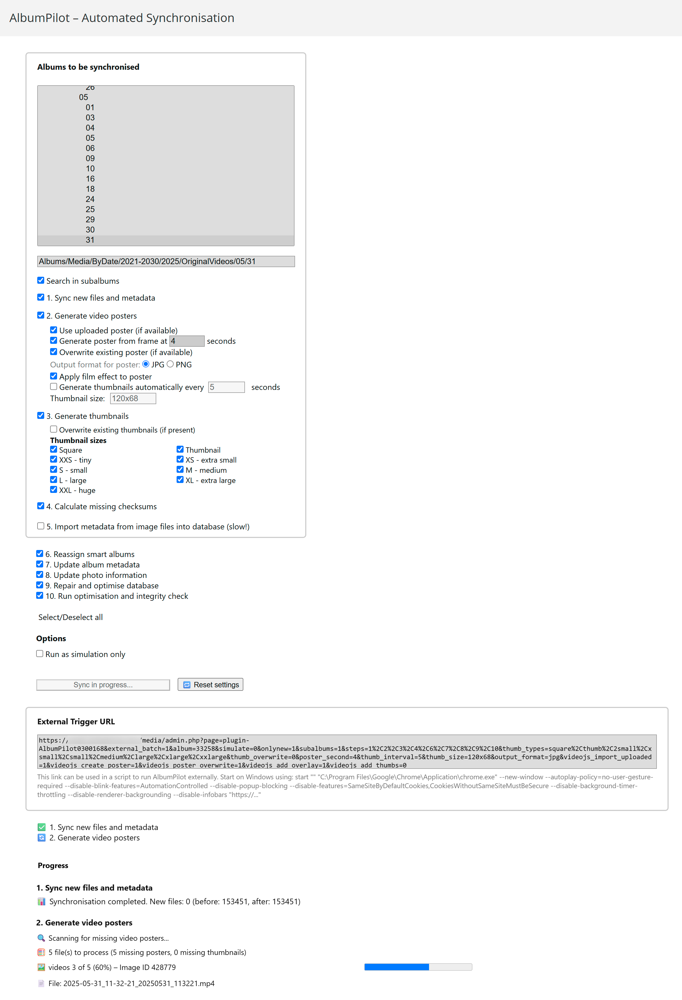

# AlbumPilot Plugin for Piwigo

**Version:** 0.3.13
**Release Date:** 2025-07-01
**Tested with:** Piwigo 15.5.0

---

## Table of Contents

- [Overview](#overview)  
  - [What's New in v0.3.13](#whats-new-in-v0313)
  - [What's New in v0.3.12](#whats-new-in-v0312)
  - [What's New in v0.3.11](#whats-new-in-v0311)
  - [What's New in v0.3.10](#whats-new-in-v0310)
  - [What's New in v0.3.9](#whats-new-in-v039)
  - [What's New in v0.3.8](#whats-new-in-v038)
  - [What's New in v0.3.7](#whats-new-in-v037)
  - [What's New in v0.3.6](#whats-new-in-v036)
  - [What's New in v0.3.5](#whats-new-in-v035)
  - [What's New in v0.3.4](#whats-new-in-v034)
  - [What's New in v0.3.3](#whats-new-in-v033)
  - [What's New in v0.3.2](#whats-new-in-v032)
  - [What's New in v0.3.1](#whats-new-in-v031)
  - [What's New in v0.3.0](#whats-new-in-v030)
  - [What's New in v0.2.1](#whats-new-in-v021)
  - [What's New in v0.2.0](#whats-new-in-v020)
  - [What's New in v0.1.1](#whats-new-in-v011)
- [Synchronization Steps](#synchronization-steps)
  - [Step 1: Sync Files](#step-1-sync-files)
  - [Step 3: Generate Video Posters](#step-3-generate-video-posters)
  - [Step 4: Generate Thumbnails](#step-2-generate-thumbnails)
  - [Step 5: Calculate Checksums](#step-4-calculate-checksums)
  - [Step 2: Update Metadata](#step-5-update-metadata)
  - [Step 6: Reassign Smart Albums](#step-6-reassign-smart-albums)
  - [Step 7: Update Album Metadata](#step-7-update-album-metadata)
  - [Step 8: Update Photo Information](#step-8-update-photo-information)
  - [Step 9: Repair and Optimize Database](#step-9-repair-and-optimize-database)
  - [Step 10: Run Integrity Check](#step-10-run-integrity-check)
- [Additional Features and Options](#additional-features-and-options)
- [Known Limitations / Issues](#known-limitations--issues)
- [Installation](#installation)
- [Usage](#usage)
- [Screenshots](#screenshots)
- [Personal Note](#personal-note)
- [License](#license)

---

## Overview

AlbumPilot automates several key synchronization steps within Piwigo, saving you time and effort during album management. It allows you to batch process file synchronization, thumbnail generation, video poster creation, metadata updates, checksum calculations, and other features with a simple, user-friendly interface.

---

## What’s New in v0.3.13

### Fixed

- **Critical bugfix:** Fixed a severe issue in Step 4 (thumbnail generation) that could accidentally delete original source image files if the “Overwrite existing thumbnails” option was enabled.  
  This affected images whose dimensions exactly matched certain thumbnail sizes.  
  Now, multiple safe-guards have been added to ensure that only actual derivative thumbnails can ever be deleted.  

  **Important:** If you ran Step 4 with the overwrite option in any previous version, I strongly recommend double-checking your albums to ensure no original photos were unintentionally removed.  
  Apologies for this oversight - despite careful testing, this edge case slipped through. Please excuse any inconvenience caused.

### Note

A simple SQL snippet and a ready-to-use shell script are provided to help you identify any potentially affected files.  
For full instructions, see the **`images_checker/README.md`** included in this plugin.

## What’s New in v0.3.12

### Fixed
- Fully restored greying-out of nested options for “Select all”/“Unselect all” and “Reset settings,” including text color.
- PNG posters are now properly detected and used as the source, resulting in thumbnails generated in the original PNG format (Step 4).

## What’s New in v0.3.11

### Changed 
- Added a separate option to overwrite existing video poster thumbnails independently from the main poster overwrite setting.

### Fixed
- Fixed an issue where disabled plugins (e.g. VideoJS or SmartAlbums) were incorrectly re-enabled in the UI after a sync run. 
- Improved the enable/disable logic for all dependent poster and thumbnail options: these now consistently follow the main step checkboxes for “Generate video posters” (step 3) and “Generate thumbnails” (step 4).
- The “Select all steps” toggle now correctly re-enables all nested sub-options for video and thumbnail generation.

### Known Limitations
- The text color for nested options under step 3 and step 4 may remain visually light gray after the workflow finishes, when selecting them via the selecet/unselect all option, even though the controls are re-enabled and clickable. This does not affect functionality but will be addressed in an upcoming patch.

### Miscellaneous
- Minor internal refactoring of dependency handlers to reduce duplicate calls.

## What’s New in v0.3.10

### Fixed
- Poster filenames now use the selected output format; old extensions are removed
- pwg_representative folder is cleared before regenerating video posters
- Apply film effect overlay works for both JPG and PNG output
- Overwrite existing thumbnails functionality has been restored

### Changed
- When switching output format, thumbnails of the previous format are deleted after successful creation
- Minor UI layout and label fixes
- Checkbox enable/disable logic for poster and thumbnail controls now depends solely on the “Generate video posters” and “Generate thumbnails” steps

## What’s New in v0.3.9

### Fixed
- Improved error handling during metadata scan: when a file (e.g. large video) cannot be processed, the metadata scan is now aborted safely without crashing the entire sync. All remaining steps continue as expected.

### Changed
- Albums and subalbums are now alphabetically sorted prior to video scan and processing. This ensures consistent order during batch processing and improves log traceability.
- Poster and thumbnail overwrite logic now safely preserves existing files: old poster or thumbnail images are only deleted if the new file has been successfully written.
-Update metadata has now become step 2 (initially being step 5), in order to enable a coherent workflow.  
- Minor UI wording adjustments and improvements.

## What’s New in v0.3.8

### Fixed
- Prevent crash during metadata update when a file is missing or unreadable: such cases are now caught and logged.

## What’s New in v0.3.7

### Fixed
- Skip video posters or thumbnails when image dimensions cannot be read, with improved error messaging.

### Changed
- Minor UI improvements.

## What’s New in v0.3.6

### Fixed
- Improved CSS styling for disabled VideoJS options now correctly applies light-gray to all labels and inputs when video poster generation is turned off.
- Thumbnail generation for `XXLarge` (and similarly sized) video posters no longer loops indefinitely: a size-equality guard has been added so that source dimensions equal to target dimensions are skipped.

## What’s New in v0.3.5

### Changed

- Log output for thumbnail generation is now localized: Thumbnail types like “medium”, “thumb”, “square” etc. are now shown in the current UI language in the log file.
- Improved CSS styling for disabled VideoJS options: All label and title texts inside disabled poster settings are now automatically rendered in light gray to visually indicate their inactive state.

### Known Issues

- **Known Issues section in README.md**: The section has been updated outlining currently known limitations and issues:
  - Persistent re-generation of large thumbnails (e.g., `XXLarge`) for certain video files.
  - Potential metadata sync problems with **HEIC** images (pending further investigation; likely a Piwigo core issue).
  - The new time-interval-based video thumbnail generation has only undergone basic testing and may be unstable; feedback is welcome.

## What’s New in v0.3.4

- Improved reset behavior after aborted syncs: interrupted runs no longer resume incorrectly.
- Settings table is now deleted on uninstall, even when plugin is renamed.
- VideoJS and SmartAlbums checkboxes now reflect status correctly on deactivation. In legacy installations, you need to manually drop the settings table once, or alternatively update to v0.3.4, then uninstall and reinstall this version again.
- All buttons are greyed out during active sync for better UX.
- Poster/thumbnail fixes, subfolder metadata bugs resolved, and root-folder error messages added.

## What’s New in v0.3.3

- All PHP short tags (`<?`) in the include files have been replaced with full opening tags (`<?php`) to ensure correct parsing when the `short_open_tag` setting is turned off.

## What’s New in v0.3.2

### Changed
- **Removed** `maintain.class.php`: table‐creation logic has been moved into `admin.php`.  
- **Uninstall cleanup**: the settings table now persists after uninstall (minimal footprint) and has to be dropped manually.  
- **Temporary backend hotfix**: restores installability broken in v0.3.1 and v0.3.0; a full fix is in progress.

## What’s New in v0.3.1

### Fixed
- The two checkboxes under Step 3 (“Import poster” and “Generate poster from frame”) are now always re-activated when you reset the Step 3 settings.
- An extra safety check has been added to prevent the plugin from ever creating thumbnails of existing video-thumbnail files.
- Disabling video thumbnail generation in the UI is now correctly honoured in batch mode (`external_run=1`), so video thumbnails stay off when you run externally.

## What's New in v0.3.0

### Added
- **Album selector dropdown** with live text search: search albums by name directly in the UI.  
- **Individual thumbnail options**: granular settings for thumbnail generation, including one-click overwrite of existing thumbnails (no manual deletion required).  
- **Individual VideoJS options**: granular settings for video posters and generated thumbnails.
- **"All Albums" parent option**: new top-level selector entry allows applying actions to all albums at once.  
- **Optional database reset during uninstall**: a maintain script is included (disabled by default) to drop the plugin’s database tables on uninstall. Ensure the plugin folder is named `AlbumPilot` if enabling it. See CHANGELOG.md for details

### Changed
- **Step order swapped**: Step 3 is now **Generate Video Posters** and Step 4 **Generate Thumbnails**, so thumbnails are generated from the updated posters.  
- **Thumbnail cleanup for VideoJS**: old thumbnails are now automatically removed when regenerating video posters (prevents showing stale images).  
- **Backend refactoring**: code reorganized for clarity and maintainability.  
- **Batch-mode enhancements**: optimized processing and reliability for external runs.  

### Fixed
- Several bug fixes across synchronization steps, UI interactions, and API handling.

## What's New in v0.2.1

### Bugfixes

- **Saved Settings No Longer Override External Parameters:**  
  A bug was fixed where user-defined settings from the database would override externally provided sync parameters (`external_run=1`). This caused external batch URLs to ignore the intended values for album, simulation mode, and selected steps.  
  Now, when an external sync is triggered, the plugin correctly:
  - uses only the parameters from the URL,
  - **does not apply** stored database settings, and
  - **does not save** external parameters back to the user’s settings.  
  This ensures a clean separation between automatic/external sync and manual/in-session use.

## What's New in v0.2.0

### Changes & Improvements

- **Plugin Directory Name Independence:**  
  AlbumPilot is now independent of its installation folder name. The plugin no longer requires a specific directory name and will function correctly regardless of how the plugin folder is named. However, folder names must not contain hyphens (`-`), as this breaks plugin activation and internal references.

- **URL-Based Execution Control:**  
  Synchronization can now be externally triggered using `external_run=1` and corresponding URL parameters. This enables automated or script-based integration without manual UI interaction.

- **Step Order Adjustment:**  
  Step 5 (Checksum Calculation) and Step 2 (Metadata Update) have been reordered to improve logical consistency and execution flow.

- **Optimized Language Loading:**  
  Only the active language is now loaded into the page, significantly reducing HTML payload. Furthermore, only translation strings relevant to the frontend interface are included in the JavaScript scope.

- **Bullet Symbol Glitch Fixed:**  
  Bullet symbols that previously appeared incorrectly in the step logs have been removed to improve visual clarity.

## What's New in v0.1.1

### Changes & Improvements

- **License Change:**  
  AlbumPilot is now released under a triple license:  
  MIT OR LGPL-2.1-or-later OR GPL-2.0-or-later.  
  Previously, it was licensed under MIT only.

- **Video Metadata Writing Added:**  
  The plugin now updates metadata (such as duration and resolution) for video files during the metadata update step (Step 5). This closes a previous gap where video files lacked associated metadata after synchronization.

- **Improved Log Symbol Consistency:**  
  Log messages across all sync steps now consistently use visual prefixes. Previously inconsistent symbol usage between steps has been aligned.

- **Bugfixes:**  
  Corrected issues where log output was not shown when invalid JSON was returned from the server.  

### Removed/Resolved Issues

- **Missing Logs at Step Start**  
  Step-specific logs (e.g., “Generating Thumbnails…”) are now reliably recorded at the very start of each step, even on first run.

- **Broken JSON Error on Start**  
  Previous issues where requests could cause malformed JSON and a UI error have been resolved. Now all steps return properly formatted JSON or display fallback diagnostics.

---

## Synchronization Steps

### Step 1: Sync Files  
This step calls Piwigo’s core synchronization mechanism to detect new, changed, or removed files and update the database accordingly. It updates the file structure and database entries to reflect the current content of the storage directories. Options allow including subalbums. It is restricted to processing only new or changed files. This step ensures the gallery is in sync with the underlying file system. Use Step 2 to update metadata of existing files. Note: unlike the Piwigo web interface, this plugin currently only reports the net number of files changed (file delta) and does not provide separate counts of additions versus deletions. 

### Step 2: Update Metadata  
This step reads metadata (EXIF, IPTC, etc.) from the image files and updates the corresponding entries in the Piwigo database for all images in the selected album(s), including subalbums if selected. The operation is performed in small batches to avoid PHP timeouts with large galleries. While the metadata update in step 1 is restricted to new or changed images, this step processes all items in the selected album.  
**Note:** This step can be very slow and resource-intensive, so it should only be run when necessary. It does not write any metadata back to the image files. If you need to embed tags or other metadata into the actual image files, use a dedicated tool or plugin like Write Metadata.

### Step 3: Generate Video Posters  
For video files, this step generates preview images ("video posters"), optionally using the "filmstrip" effect, which captures a frame 4 seconds into the video. You can customize all VideoJS parameters (poster time, overlay, thumbnail interval, output format, etc.) via the plugin UI. When a poster is regenerated, any previously generated thumbnails are automatically deleted, preventing stale images from appearing (unlike the official VideoJS behavior).

In addition to a single poster, the plugin can now also automatically produce **video thumbnails** at a defined interval (e.g. every 5 seconds), creating a series of preview frames throughout the duration of the video. These video thumbnails differ from the standard image thumbnails generated in **Step 4**—which are simply resized copies of original photos—in that they are actual frames extracted from the video itself, offering a storyboard-like sequence.

This step requires the **piwigo-videojs** plugin to be installed and active; it is otherwise disabled. Video posters (and video thumbnails) are generated only for videos that do not yet have a poster image, or when you explicitly choose to overwrite them.

### Step 4: Generate Thumbnails  
AlbumPilot generates missing thumbnails for images in all resolutions defined in the configuration. You can specify which thumbnail types to create or overwrite. An overwrite option is also available. so you can force-regenerate existing thumbnails (for example, if they have been modified externally). Otherwise, only images without existing thumbnails are processed, avoiding redundant work.

### Step 5: Calculate Checksums  
This step computes and stores MD5 checksums for images that are missing them in the database. It processes only images without existing checksums, and it works in batches to maintain stability during long runs. It is limited to items contained in the chosen folder.

### Step 6: Reassign Smart Albums  
This step triggers the **SmartAlbums** plugin’s function to regenerate smart album assignments for images. It automates what normally requires manual activation in the SmartAlbums plugin interface. If the SmartAlbums plugin is not installed or activated, this step is disabled.

### Step 7: Update Album Metadata  
Corresponds to clicking the **“Update album information”** button on Piwigo’s **Maintenance** page. It refreshes metadata related to albums themselves, ensuring album properties and structures are up to date.

### Step 8: Update Photo Information  
Corresponds to clicking the **“Update photo information”** button on the **Maintenance** page. This refreshes various stored photo metadata, such as EXIF or other tags, ensuring photo records in the database are current.

### Step 9: Repair and Optimize Database  
Corresponds to the **“Repair and optimize database”** function on the **Maintenance** page. This step runs maintenance commands to fix inconsistencies and optimize database performance.

### Step 10: Run Integrity Check  
Corresponds to clicking the **“Check database integrity”** button on the **Maintenance** page. It performs a consistency check across the database and file system to identify and report errors or missing data.

## Additional Features and Options

- **Copyable External URL String**  
  The plugin provides a ready-made synchronization URL based on your current selection. This can be used to execute the sync externally using `external_run=1` and additional step parameters.

  For Windows users, this URL must be launched using a `.bat` file or command line with specific Chrome startup flags.  
  **It is not enough to simply paste the URL into the browser or launch it via the file explorer.** While the URL will open, the synchronization will **not start automatically**, because modern Chromium-based browsers block scripted actions (like `.click()` or `.submit()`) unless they are triggered by a real user gesture.

To reliably trigger synchronization without manual interaction, Chrome must be launched with flags that disable these restrictions.

  **Example command to use in a `.bat` file:**

``batch
start "" "C:\Program Files\Google\Chrome\Application\chrome.exe" ^
  --new-window ^
  --autoplay-policy=no-user-gesture-required ^
  --disable-blink-features=AutomationControlled ^
  --disable-popup-blocking ^
  "https://..."

- **State Preservation of Checkbox Settings**  
  AlbumPilot remembers your selections across sessions, so you do not need to reselect options each time. You can reset these stored settings manually if needed.

- **Simulation Mode**  
  Executes all selected steps in a dry-run mode. No thumbnails, video posters, checksums, or metadata are written. This allows previewing the number of actions that would be taken. Steps 1 and 6-10 are skipped entirely in simulation mode. 

- **Include Subalbums Option**  
  Applies to steps 1-5. When enabled, AlbumPilot processes not only the selected album but also all its nested subalbums recursively.

- **Per-Step Execution Control**  
  Each of the 10 steps can be individually enabled or disabled. Plugin-dependent steps (e.g., SmartAlbums or VideoJS) are automatically disabled if the required plugins are not active.

- **Album Selection Scope**  
  Album selection applies only to steps 1-5, which operate specifically on the selected album (and optionally subalbums). Steps 6-10 are global and run independently of any album selection.

- **Select All / Deselect All**  
  Quickly select or deselect all steps with one click to simplify setup.

- **Synchronization Status and Logs**  
  A detailed log is written during synchronization, showing step-by-step progress and errors if they occur. Ensure the web server has write permissions on the plugin directory for logging to work properly.

- **Reset Settings**  
  Allows you to manually reset all saved checkbox selections in the plugin interface. Use this if you want to start fresh with default options for your next synchronization run.

## Known Limitations / Issues

### Thumbnail Generation for Videos (Timed Intervals)

The feature for generating thumbnails at fixed time intervals (e.g. every 5 seconds) has only undergone basic testing and may be unstable; feedback is welcome.

## Installation

1. Upload the `AlbumPilot` plugin folder to your Piwigo plugins directory. The plugin folder name is flexible, but must not contain hyphens (`-`), as this causes activation issues and interfere with internal plugin ID resolution (use only letters, numbers and underscores). Renaming the folder is mainly intended for testing so you don’t end up with stale JavaScript or other assets in your browser cache; for a stable production setup, however, stick with the plain `AlbumPilot` name.
> Note: GitHub ZIP archives often extract into folders like `AlbumPilot-main` or `AlbumPilot-0.3.4`. Please rename the folder to remove hyphens before installing the plugin.
2. Ensure the web server has write permissions on the plugin directory to enable log writing.  
3. For full functionality, install and activate the **piwigo-videojs** and **SmartAlbums** plugins as needed.
> Legacy installations: If you previously experienced disabled but checked checkboxes for VideoJS or SmartAlbums, you must first update to version 0.3.4, then uninstall and reinstall this version once to allow the outdated settings table to be removed properly.

## Usage

1. Select the album(s) and desired options in the AlbumPilot admin interface.  
2. Click “Start synchronization” to begin the synchronization process.  
3. Monitor progress and logs in the provided interface panel.  
4. You may use the “Reset Settings” button to reset saved checkbox states.

## Screenshots

### Video Poster Generation (Step 4)

This screenshot shows the progress interface while generating video posters (Step 4), including real-time percentage, image ID, and thumbnail type.

## Acknowledgements

A huge thank you to **windracer**/[@jradwan](https://github.com/jradwan) for his ongoing support, extensive testing, detailed feedback and countless suggestions!

## Personal Note

This plugin was developed by me in my spare time to address a very specific need I had for managing my large Piwigo installation with over one hundred thousand images. Over time, the default Piwigo interface for synchronization and metadata updates became quite cumbersome for my workflow, especially because manual clicks were needed for each step.

While Piwigo already provides a great interface and solid core functionality, I wanted to streamline the process by unifying several steps into a single, more automated tool. AlbumPilot is my solution to that. It simplifies and speeds up synchronization with just one click.

Key improvements include handling metadata updates in smaller chunks to avoid timeout issues, which was a frequent problem in the past. This makes longer syncs more stable, although total processing time may sometimes be longer due to chunking. I have not yet extensively tested the plugin with very large datasets beyond my current collection, but so far it has been reliable and efficient for my needs.

Generating thumbnails was especially important to me because my setup runs on a relatively slow NAS with a low-powered processor. While it can reliably generate images in the background on that system, it is too slow to handle live thumbnail generation when accessing the images via the gallery, particularly for very high-resolution images. In the past, this caused the system to hang and become unresponsive.

My workflow has therefore been to first generate all thumbnails on the server before linking the images with Smart Albums. Since I use Smart Albums to control access permissions, this approach ensures that users only get access to images once all thumbnails are ready. This prevents the system from being overwhelmed by multiple users accessing images whose thumbnails are not yet generated. This also explains the order of steps in AlbumPilot: thumbnails are generated first, then Smart Albums are updated to “unlock” access, providing a stable and predictable synchronization process.

Also, updating image information and album metadata was crucial for me. Without manually triggering the album metadata update (step 7), new images may not show up immediately and might only appear after a while. This was one of the main reasons I integrated these steps into the plugin for smoother, more immediate synchronization.

Currently, the plugin is only available in German and English. Translations to other languages are very welcome. 

There is no official support for this plugin. 

The code has been cleaned and refactored as much as possible, but some redundancies and unused functions may remain; it was done to the best of my knowledge. However, at present it works and serves its purpose. As a side note, this is my first software project for quite a while, so please be gentle!

Feel free to use and adapt it as you wish. I hope it makes your Piwigo synchronization tasks easier and more pleasant!

**Disclaimer:** This plugin is provided as-is, developed in my spare time as a hobby project. There is no warranty or official support. Use at your own risk.

---

**License:**  
This project is triple-licensed under the following terms — you may choose the one that best fits your needs:

1. MIT License (MIT)  
2. GNU Lesser General Public License v2.1 or (at your option) any later version (LGPL-2.1-or-later)  
3. GNU General Public License v2.0 or (at your option) any later version (GPL-2.0-or-later)

© 2025 Hendrik Schöttle
