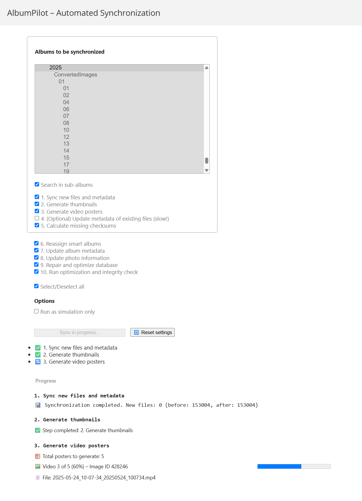

# AlbumPilot Plugin for Piwigo

**Version:** 0.1.1
**Release Date:** 2025-05-28  
**Tested with:** Piwigo 15.5.0

---

## Table of Contents

- [Overview](#overview)
  - [What's New in v0.1.1](#whats-new-in-v0.1.1)
  - [Changes & Improvements](#changes--improvements)
  - [Removed/Resolved Issues](#removedresolved-issues)
- [Synchronization Steps](#synchronization-steps)- [Synchronization Steps](#synchronization-steps)
  - [Step 1: Sync Files](#step-1-sync-files)
  - [Step 2: Generate Thumbnails](#step-2-generate-thumbnails)
  - [Step 3: Generate Video Posters](#step-3-generate-video-posters)
  - [Step 4: Update Metadata](#step-4-update-metadata)
  - [Step 5: Calculate Checksums](#step-5-calculate-checksums)
  - [Step 6: Reassign Smart Albums](#step-6-reassign-smart-albums)
  - [Step 7: Update Album Metadata](#step-7-update-album-metadata)
  - [Step 8: Update Photo Information](#step-8-update-photo-information)
  - [Step 9: Repair and Optimize Database](#step-9-repair-and-optimize-database)
  - [Step 10: Run Integrity Check](#step-10-run-integrity-check)
- [Additional Features](#additional-features)
- [Known Limitations / Issues](#known-limitations--issues)
- [Installation](#installation)
- [Usage](#usage)
- [Personal Note](#personal-note)
- [License](#license)

---

## Overview

AlbumPilot automates several key synchronization steps within Piwigo, saving you time and effort during album management. It allows you to batch process file synchronization, thumbnail generation, video poster creation, metadata updates, checksum calculations, and other features with a simple, user-friendly interface.

---

## What's New in v0.1.1

### Changes & Improvements

- **License Change:**  
  AlbumPilot is now released under a triple license:  
  MIT OR LGPL-2.1-or-later OR GPL-2.0-or-later.  
  Previously, it was licensed under MIT only.

- **Video Metadata Writing Added:**  
  The plugin now updates metadata (such as duration and resolution) for video files during the metadata update step (Step 4). This closes a previous gap where video files lacked associated metadata after synchronization.

- **Improved Log Symbol Consistency:**  
  Log messages across all sync steps now consistently use visual prefixes. Previously inconsistent symbol usage between steps has been aligned.

- **Bugfixes:**  
  Corrected issues where log output was not shown when invalid JSON was returned from the server.  

### Removed/Resolved Issues

- **Missing Logs at Step Start**  
  Step-specific logs (e.g., “Generating Thumbnails…”) are now reliably recorded at the very start of each step, even on first run.

- **Broken JSON Error on Start**  
  Previous issues where requests could cause malformed JSON and a UI error have been resolved. Now all steps return properly formatted JSON or display fallback diagnostics.

---

## Synchronization Steps

### Step 1: Sync Files  
This step calls Piwigo’s core synchronization mechanism to detect new, changed, or removed files and update the database accordingly. It updates the file structure and database entries to reflect the current content of the storage directories. Options allow including subalbums. It is currently restricted to processing only new or changed files. This step ensures the gallery is in sync with the underlying file system.

### Step 2: Generate Thumbnails  
AlbumPilot generates missing thumbnails for images in all resolutions defined by Piwigo’s configuration. Currently, there is no option to customize which thumbnail sizes are generated through the plugin, the thumbnail size information is derived from the Piwigo setup. Only images without existing thumbnails are processed, avoiding redundant work. 

### Step 3: Generate Video Posters  
For video files, this step generates preview images ("video posters") using the "filmstrip" effect, which captures a frame 4 seconds into the video. This requires the **piwigo-videojs** plugin to be installed and active, it is otherwise disabled. Video posters are generated only for videos that do not yet have a poster image.

### Step 4: Update Metadata  
This step updates photo metadata (EXIF, IPTC, etc.) for images in the selected album(s) and optionally their subalbums. The process is done in small batches (chunks) to avoid PHP timeout issues common with large libraries. While the metadata update in step 1 is restricted to new or changed images, this step processes all items in the selected Album. **Note:** This step can be very slow and resource-intensive, so it should only be run when necessary.

### Step 5: Calculate Checksums  
This step computes and stores MD5 checksums for images that are missing them in the database. It processes only images without existing checksums, and it works in batches to maintain stability during long runs. It is limited to items contained in the chosen folder.

### Step 6: Reassign Smart Albums  
This step triggers the **SmartAlbums** plugin’s function to regenerate smart album assignments for images. It automates what normally requires manual activation in the SmartAlbums plugin interface. If the SmartAlbums plugin is not installed or activated, this step is disabled.

### Step 7: Update Album Metadata  
Corresponds to clicking the **“Update album information”** button on Piwigo’s **Maintenance** page. It refreshes metadata related to albums themselves, ensuring album properties and structures are up to date.

### Step 8: Update Photo Information  
Corresponds to clicking the **“Update photo information”** button on the **Maintenance** page. This refreshes various stored photo metadata, such as EXIF or other tags, ensuring photo records in the database are current.

### Step 9: Repair and Optimize Database  
Corresponds to the **“Repair and optimize database”** function on the **Maintenance** page. This step runs maintenance commands to fix inconsistencies and optimize database performance.

### Step 10: Run Integrity Check  
Corresponds to clicking the **“Check database integrity”** button on the **Maintenance** page. It performs a consistency check across the database and file system to identify and report errors or missing data.

## Additional Features and Options

- **State Preservation of Checkbox Settings**  
  AlbumPilot remembers your selections across sessions, so you do not need to reselect options each time. You can reset these stored settings manually if needed.

- **Simulation Mode**  
  Executes all selected steps in a dry-run mode. No thumbnails, video posters, checksums, or metadata are written. This allows previewing the number of actions that would be taken. Steps 1 and 6-10 are skipped entirely in simulation mode. 

- **Include Subalbums Option**  
  Applies to steps 1-5. When enabled, AlbumPilot processes not only the selected album but also all its nested subalbums recursively.

- **Per-Step Execution Control**  
  Each of the 10 steps can be individually enabled or disabled. Plugin-dependent steps (e.g., SmartAlbums or VideoJS) are automatically disabled if the required plugins are not active.

- **Album Selection Scope**  
  Album selection applies only to steps 1-5, which operate specifically on the selected album (and optionally subalbums). Steps 6-10 are global and run independently of any album selection.

- **Select All / Deselect All**  
  Quickly select or deselect all steps with one click to simplify setup.

- **Synchronization Status and Logs**  
  A detailed log is written during synchronization, showing step-by-step progress and errors if they occur. Ensure the web server has write permissions on the plugin directory for logging to work properly.

- **Reset Settings**  
  Allows you to manually reset all saved checkbox selections in the plugin interface. Use this if you want to start fresh with default options for your next synchronization run.

## Known Limitations / Issues

Originally, the synchronization progress was intended to be freshly initialized at each start, resetting all counters and states. However, at present, progress is currently stored between runs to attempt resuming where it left off. This approach is however not reliable and sometimes resets the states as intended. To fully reset, users can toggle simulation mode on and off and run the process twice, which clears the progress state. Contributions or suggestions for a fix are welcome.

## Installation

1. Upload the `AlbumPilot` plugin folder to your Piwigo plugins directory. Make sure it is named `AlbumPilot` only (remove any additional version number). 
2. Activate the plugin via the Piwigo administration panel.  
3. Ensure the web server has write permissions on the plugin directory to enable log writing.  
4. For full functionality, install and activate the **piwigo-videojs** and **SmartAlbums** plugins as needed.

## Usage

1. Select the album(s) and desired options in the AlbumPilot admin interface.  
2. Click “Start synchronization” to begin the synchronization process.  
3. Monitor progress and logs in the provided interface panel.  
4. You may use the “Reset Settings” button to reset saved checkbox states.

## Screenshots

### Video Poster Generation (Step 3)

This screenshot shows the progress interface while generating video posters (Step 3), including real-time percentage, image ID, and thumbnail type.

## Personal Note

This plugin was developed by me in my spare time to address a very specific need I had for managing my large Piwigo installation with over one hundred thousand images. Over time, the default Piwigo interface for synchronization and metadata updates became quite cumbersome for my workflow, especially because manual clicks were needed for each step.

While Piwigo already provides a great interface and solid core functionality, I wanted to streamline the process by unifying several steps into a single, more automated tool. AlbumPilot is my solution to that. It simplifies and speeds up synchronization with just one click.

Key improvements include handling metadata updates in smaller chunks to avoid timeout issues, which was a frequent problem in the past. This makes longer syncs more stable, although total processing time may sometimes be longer due to chunking. I have not yet extensively tested the plugin with very large datasets beyond my current collection, but so far it has been reliable and efficient for my needs.

Generating thumbnails was especially important to me because my setup runs on a relatively slow NAS with a low-powered processor. While it can reliably generate images in the background on that system, it is too slow to handle live thumbnail generation when accessing the images via the gallery, particularly for very high-resolution images. In the past, this caused the system to hang and become unresponsive.

My workflow has therefore been to first generate all thumbnails on the server before linking the images with Smart Albums. Since I use Smart Albums to control access permissions, this approach ensures that users only get access to images once all thumbnails are ready. This prevents the system from being overwhelmed by multiple users accessing images whose thumbnails are not yet generated. This also explains the order of steps in AlbumPilot: thumbnails are generated first, then Smart Albums are updated to “unlock” access, providing a stable and predictable synchronization process.

Also, updating image information and album metadata was crucial for me. Without manually triggering the album metadata update (step 7), new images may not show up immediately and might only appear after a while. This was one of the main reasons I integrated these steps into the plugin for smoother, more immediate synchronization.

Currently, the plugin is only available in German and English. Translations to other languages are very welcome. 

There is no official support for this plugin. 

The code has been cleaned and refactored as much as possible, but some redundancies and unused functions may remain; it was done to the best of my knowledge. However, at present it works and serves its purpose. As a side note, this is my first software project for quite a while, so please be gentle!

Feel free to use and adapt it as you wish. I hope it makes your Piwigo synchronization tasks easier and more pleasant!

**Disclaimer:** This plugin is provided as-is, developed in my spare time as a hobby project. There is no warranty or official support. Use at your own risk.

---

**License:**  
This project is triple-licensed under the following terms — you may choose the one that best fits your needs:

1. MIT License (MIT)  
2. GNU Lesser General Public License v2.1 or (at your option) any later version (LGPL-2.1-or-later)  
3. GNU General Public License v2.0 or (at your option) any later version (GPL-2.0-or-later)

© 2025 Hendrik Schöttle
