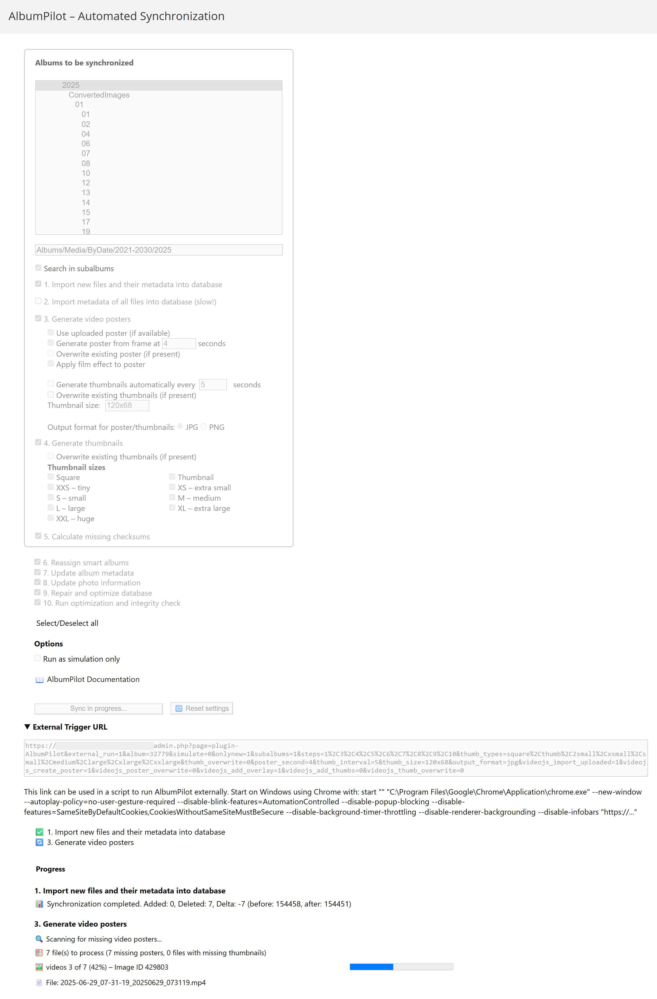

# AlbumPilot Plugin for Piwigo

**Version:** 1.1.0  
**Release Date:** 2025-09-28
**Tested with:** Piwigo 15.6.0

---

## Table of Contents

- [Overview](#overview)
- [What's New in v1.1.0](#whats-new-in-v110)
- [Synchronization Steps](#synchronization-steps)
  - [Step 1: Sync Files](#step-1-sync-files)
  - [Step 2: Update Metadata](#step-2-update-metadata)
  - [Step 3: Generate Video Posters](#step-3-generate-video-posters)
  - [Step 4: Generate Thumbnails](#step-4-generate-thumbnails)
  - [Step 5: Calculate Checksums](#step-5-calculate-checksums)
  - [Step 6: Reassign Smart Albums](#step-6-reassign-smart-albums)
  - [Step 7: Update Album Metadata](#step-7-update-album-metadata)
  - [Step 8: Update Photo Information](#step-8-update-photo-information)
  - [Step 9: Repair and Optimize Database](#step-9-repair-and-optimize-database)
  - [Step 10: Run Integrity Check](#step-10-run-integrity-check)
- [Additional Features and Options](#additional-features-and-options)
- [Known Limitations / Issues](#known-limitations--issues)
- [Installation](#installation)
- [Usage](#usage)
- [Screenshots](#screenshots)
- [Acknowledgements](#acknowledgements)
- [Personal Note](#personal-note)
- [License](#license)

---

## Overview

AlbumPilot automates several key synchronization steps within Piwigo, saving you time and effort during album management. It allows you to batch process file synchronization, thumbnail generation, video poster creation, metadata updates, checksum calculations, and other features with a simple, user-friendly interface.

Thanks to its chunked processing architecture, long-running tasks, including metadata updates for existing files, run reliably to completion, even when they take considerable time.

---
## What's New in v1.1.0

### Added
- New translations: Catalan, Spanish, French, Hebrew, and Norwegian Bokmål - thanks to the community contributors!
- Updated language file headers with translator acknowledgements.

### Changed
- Log files are no longer written into the plugin directory.  
  Instead, AlbumPilot now uses Piwigo’s recommended location:  
  `_data/logs/album_pilot.log`  
  (with automatic rotation once the log exceeds 100 MB).

### Fixed
- Minor improvements in language handling and frontend translation isolation.

*For the full history of changes, see [CHANGELOG.md](./CHANGELOG.md).*

---

## Synchronization Steps

### Prerequisite: Select an Album
Before running any steps, select the album you want to process. You can use the album dropdown list or start typing in the search field below it to filter and pick by name. Suggestions appear as you type.

This selection is required for Steps 1-5 (which run on the chosen album and, if enabled, its subalbums) but must also be made even if you only intend to run Steps 6-10 (which run globally and ignore album selection).

Optionally enable **Include Subalbums** to process not only the selected album but all nested subalbums. Your album choice and subalbum setting are stored for future runs.

### Step 1: Sync Files  
This step calls Piwigo's core synchronization mechanism to detect new, changed, or removed files and update the database accordingly. It updates the file structure and database entries to reflect the current content of the storage directories. It is restricted to processing only new or changed files. This step ensures the gallery is in sync with the underlying file system. Use Step 2 to update metadata of existing files.

### Step 2: Update Metadata  
This step reads metadata (EXIF, IPTC, etc.) from the image files and updates the corresponding entries in the Piwigo database for all images in the selected album(s). The operation is performed in small batches to avoid PHP timeouts with large galleries. While the metadata update in step 1 is restricted to new or changed images, this step processes **all** items in the selected album.  
**Note:** This step can be very slow and resource-intensive, so it should only be run when necessary. It does not write any metadata back to the image files. If you need to embed tags or other metadata into the actual image files, use a dedicated tool or plugin like Write Metadata.

### Step 3: Generate Video Posters  
For video files, this step generates preview images ("video posters"), optionally using the "filmstrip" effect. By default, it captures a frame 4 seconds into the video, but this and other VideoJS parameters (poster time, overlay, thumbnail interval, output format, etc.) are fully customizable via the plugin UI. When a poster is regenerated, any previously generated thumbnails are automatically deleted, preventing stale images from appearing (unlike the official VideoJS behavior).

In addition to a single poster, the plugin can also automatically produce **video thumbnails** at a defined interval (e.g. every 5 seconds), creating a series of preview frames throughout the duration of the video. These video thumbnails differ from the standard image thumbnails generated in **Step 4**, which are simply resized copies of original photos, in that they are actual frames extracted from the video itself, offering a storyboard-like sequence.

This step requires the **piwigo-videojs** plugin to be installed and active; it is otherwise disabled. Video posters (and video thumbnails) are generated only for videos that do not yet have a poster image, or when you explicitly choose to overwrite them.

### Step 4: Generate Thumbnails  
AlbumPilot generates missing thumbnails for images in all resolutions defined in the configuration. You can specify which thumbnail types to create or overwrite. An overwrite option is also available, so you can force-regenerate existing thumbnails (for example, if they have been modified externally). Otherwise, only images without existing thumbnails are processed, avoiding redundant work.

### Step 5: Calculate Checksums  
This step computes and stores MD5 checksums for images that are missing them in the database. It processes only images without existing checksums, and it works in batches of 10 images to maintain stability during long runs. It is limited to items contained in the chosen folder.

### Step 6: Reassign Smart Albums  
This step triggers the **SmartAlbums** plugin's function to regenerate smart album assignments for images. It automates what normally requires manual activation in the SmartAlbums plugin interface. If the SmartAlbums plugin is not installed or activated, this step is disabled.

### Step 7: Update Album Metadata  
Corresponds to clicking the **"Update album information"** button on Piwigo's **Maintenance** page. It refreshes metadata related to albums themselves, ensuring album properties and structures are up to date.

### Step 8: Update Photo Information  
Corresponds to clicking the **"Update photo information"** button on the **Maintenance** page. This refreshes various stored photo metadata, such as EXIF or other tags, ensuring photo records in the database are current.

### Step 9: Repair and Optimize Database  
Corresponds to the **"Repair and optimize database"** function on the **Maintenance** page. This step runs maintenance commands to fix inconsistencies and optimize database performance.

### Step 10: Run Integrity Check  
Corresponds to clicking the **"Check database integrity"** button on the **Maintenance** page. It performs a consistency check across the database and file system to identify and report errors or missing data.

## Additional Features and Options

- **Copyable External URL String**  
  The plugin provides a ready-made synchronization URL based on your current selection. This can be used to execute the sync externally using `external_run=1` and additional step parameters.

  This URL can be launched from batch files, automation scripts, or other tools. In many browsers (especially Chrome), simply pasting it may open the page but not start the sync automatically, due to automated-action restrictions. To avoid this in Chrome, launch it with flags such as:

  ```
  start "" "C:\Program Files\Google\Chrome\Application\chrome.exe" --new-window --autoplay-policy=no-user-gesture-required --disable-blink-features=AutomationControlled --disable-popup-blocking --disable-features=SameSiteByDefaultCookies,CookiesWithoutSameSiteMustBeSecure --disable-background-timer-throttling --disable-renderer-backgrounding --disable-infobars "https://..."
  ```
  
**Note:** The browser used must be logged in to Piwigo with "stay signed in" enabled, otherwise the sync URL will prompt for authentication.

- **State Preservation of Checkbox Settings**  
AlbumPilot remembers your selections across sessions, so you do not need to reselect options each time. You can reset these stored settings manually if needed.

- **Simulation Mode**  
Executes all selected steps in a dry-run mode. No thumbnails, video posters, checksums, or metadata are written. This allows previewing the number of actions that would be taken. Steps 1 and 6-10 are skipped entirely in simulation mode. Simulations still process every selected item in chunks and, on very large galleries, can take almost as long as a real run. However, at the start of each step, a summary line displays how many items (e.g. images, video posters) will be processed, so you can cancel the simulation run mid-stream if you're only evaluating the simulation.

- **Per-Step Execution Control**  
Each of the 10 steps can be individually enabled or disabled. Plugin-dependent steps (SmartAlbums and VideoJS) are automatically disabled if the required plugins are not active.

- **Select All / Deselect All**  
Quickly select or deselect all steps with one click to simplify setup.

- **Synchronization Status and Logs**  
A detailed log (`album_pilot.log`) is written to the plugin's home directory during synchronization, recording each step's progress and any errors. Once the log exceeds 100 MB, the current `album_pilot.log` is renamed to `album_pilot_old.log` (overwriting any existing `album_pilot_old.log`), and a fresh `album_pilot.log` is created. Ensure the web server has write permissions in the plugin directory so logging functions correctly.

- **Reset Settings**  
Allows you to manually reset all saved checkbox selections in the plugin interface. Use this if you want to start fresh with default options for your next synchronization run.

## Known Limitations / Issues

Until now, running a full Piwigo sync via the core functions could be cumbersome, as long scripts often hit PHP timeouts (`max_execution_time`) or memory limits (`memory_limit`) before completion, so many hidden issues never surfaced. AlbumPilot sticks as closely as possible to Piwigo's standard workflows, in most cases calling the same core functions, but only in smaller chunks. So errors you encounter (e.g., corrupt database entries or broken image files) may reflect existing issues in your gallery rather than bugs in the plugin. However, extremely large files (for example, video files over 10 GB) or very large galleries can still trigger server, PHP, or database constraints (such as `max_allowed_packet` or `group_concat_max_len`), nonetheless generally resulting in clean aborts that are logged.

Sync operations run over HTTP and require a stable network connection. Intermittent or forced disconnections can cause tasks to abort; in such cases, try breaking the sync into smaller segments or processing fewer items per run.

## Installation

1. **Via Plugin Manager:**  
 - Search for **AlbumPilot** under **Plugins -> Plugin Manager -> Install** in your Piwigo admin panel. Then install and activate it.
 - *If you do not see it listed yet, please use the manual installation instead.*

2. **Manual Installation (ZIP archive):**  
 - Download and unzip the archive into `plugins/AlbumPilot` (folder name must not contain hyphens, only letters, numbers, and underscores).
 - Make sure your web server user can write to `plugins/AlbumPilot/` (for logging, e.g. `chmod -R 755 plugins/AlbumPilot/` or `chmod -R 775` depending on your server setup).

3. **Dependencies:**  
 - For full functionality, install and activate the **piwigo-videojs** and **SmartAlbums** plugins as needed.

## Usage

1. Select the album(s) and desired options in the AlbumPilot admin interface.
2. Click "Start synchronization" to begin the synchronization process.
3. Monitor progress and logs in the provided interface panel.
4. You may use the "Reset Settings" button to reset saved checkbox states.

## Screenshots

### Video Poster Generation (Step 3)

This screenshot shows the progress interface while generating video posters (Step 3), including real-time percentage, image ID, and thumbnail type.



## Acknowledgements

A huge thank you to **windracer**/[@jradwan](https://github.com/jradwan) for his ongoing support, extensive testing, detailed feedback and countless suggestions!

## Personal Note

This plugin was developed by me in my spare time to address a very specific need I had for managing my large Piwigo installation with over 150k images. Over time, the default Piwigo interface for synchronization and metadata updates became quite cumbersome for my workflow, especially because manual clicks were needed for each step.

While Piwigo already provides a great interface and solid core functionality, I wanted to streamline the process by unifying several steps into a single, more automated tool. AlbumPilot is my solution to that. It simplifies and speeds up synchronization with just one click.

Key improvements include handling metadata updates in smaller chunks to avoid timeout issues, which was a frequent problem in the past. This makes longer syncs more stable, although total processing time may sometimes be longer due to chunking.

Generating thumbnails was especially important to me because my setup runs on a relatively slow NAS with a low-powered processor. While it can reliably generate images in the background on that system, it is too slow to handle live thumbnail generation when accessing the images via the gallery, particularly for very high-resolution images. In the past, this caused the system to hang and become unresponsive.

My workflow has therefore been to first generate all thumbnails on the server before linking the images with SmartAlbums. Since I use SmartAlbums to control access permissions, this approach ensures that users only get access to images once all thumbnails are ready. This prevents the system from being overwhelmed by multiple users accessing images whose thumbnails are not yet generated. This also explains the order of steps in AlbumPilot: thumbnails are generated first, then SmartAlbums are updated to "unlock" access, providing a stable and predictable synchronization process.

Also, updating image information and album metadata was crucial for me. Without manually triggering the album metadata update (step 7), new images may not show up immediately and might only appear after a while. This was one of the main reasons I integrated these steps into the plugin for smoother, more immediate synchronization.

Currently, the plugin is only available in German and English. Translations to other languages are very welcome.

There is no official support for this plugin.

The code has been cleaned and refactored as much as possible, but some redundancies and unused functions may remain; it was done to the best of my knowledge. However, at present it works and serves its purpose. As a side note, this is my first software project for quite a while, so please be gentle!

Feel free to use and adapt it as you wish. I hope it makes your Piwigo synchronization tasks easier and more pleasant!

**Disclaimer:** This plugin is provided as-is, developed in my spare time as a hobby project. There is no warranty or official support. Use at your own risk.

---

**License:**  
This project is triple-licensed under the following terms, you may choose the one that best fits your needs:

1. MIT License (MIT)  
2. GNU Lesser General Public License v2.1 or (at your option) any later version (LGPL-2.1-or-later)  
3. GNU General Public License v2.0 or (at your option) any later version (GPL-2.0-or-later)

*See [LICENSE](LICENSE) for further details.*

(c) 2025 Hendrik Schöttle
